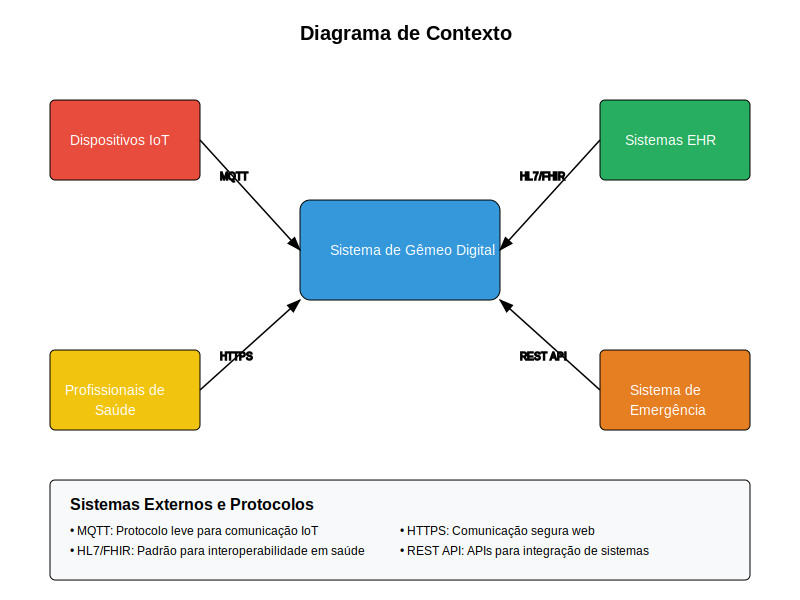
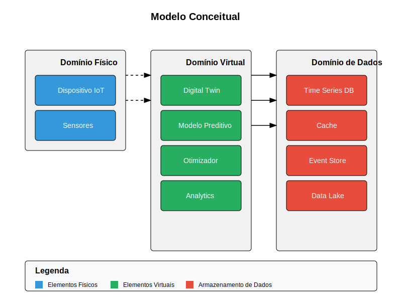
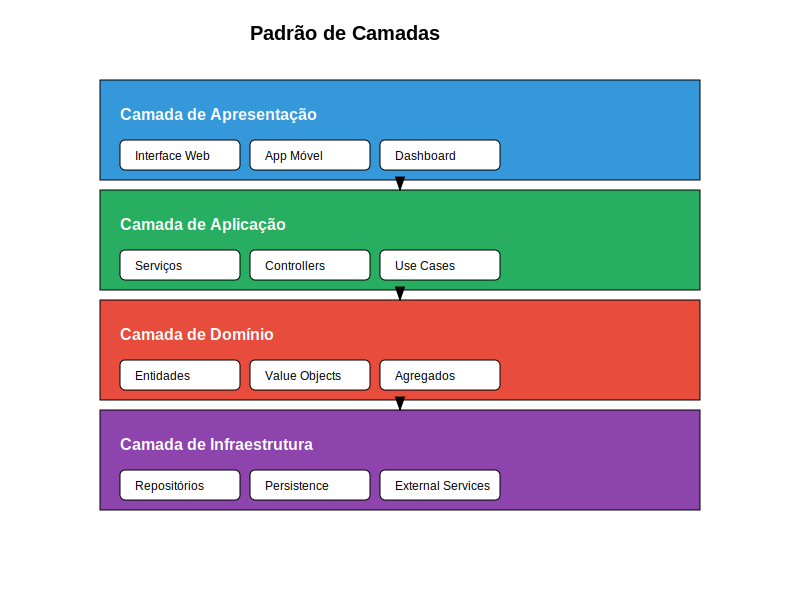
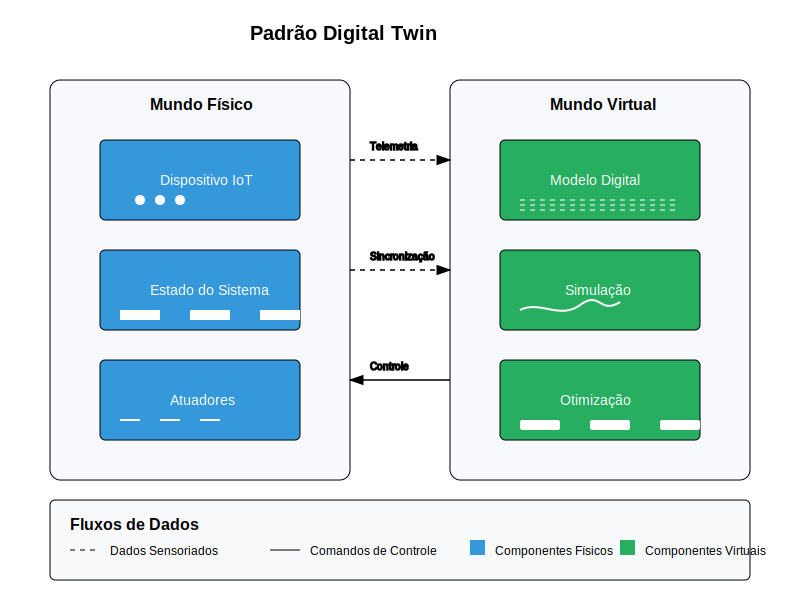
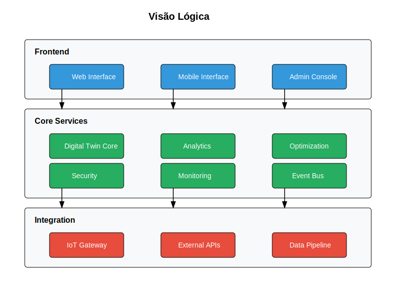
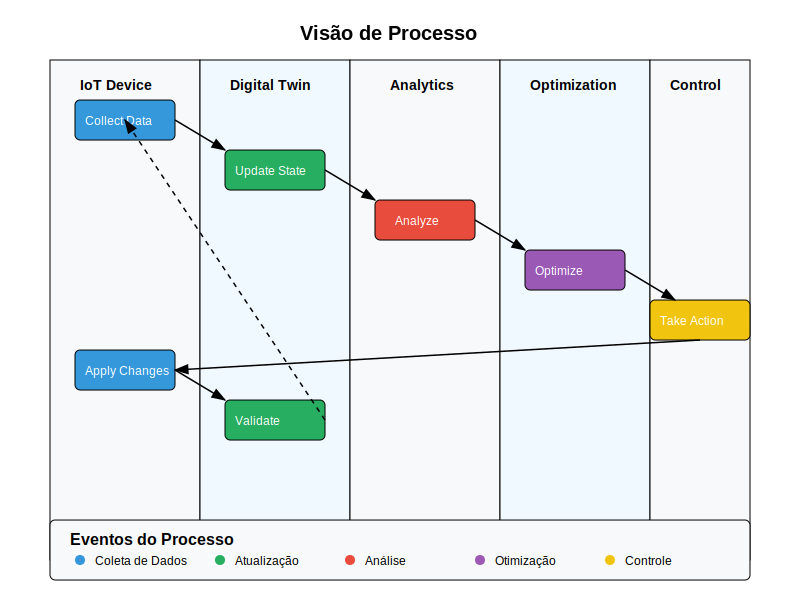
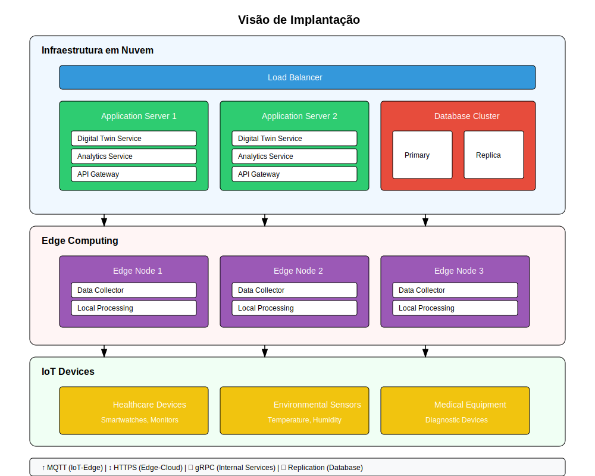
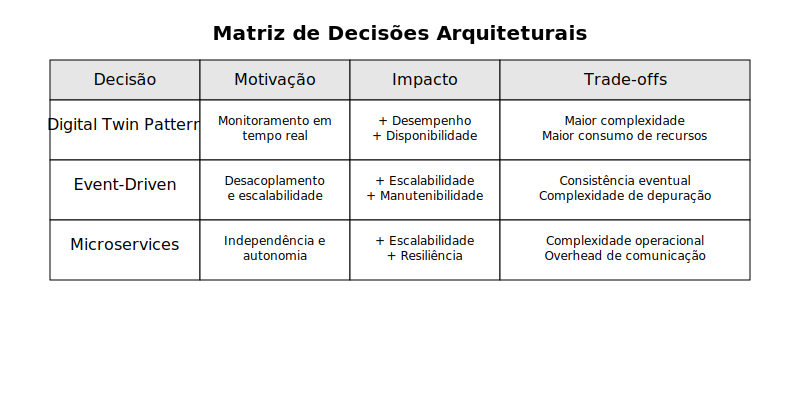
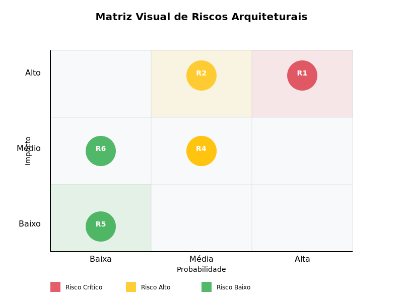

# Documento de Arquitetura
## Sistema de Gêmeo Digital para Monitoramento de Saúde e Otimização de Energia

### Sumário
1. [Introdução](#1-introdução)
2. [Requisitos Arquiteturalmente Significativos](#2-requisitos-arquiteturalmente-significativos)
3. [Visão Geral da Solução](#3-visão-geral-da-solução)
4. [Padrões Arquiteturais Adotados](#4-padrões-arquiteturais-adotados)
5. [Visões Arquiteturais](#5-visões-arquiteturais)
6. [Decisões Arquiteturais](#6-decisões-arquiteturais)
7. [Qualidade e Táticas Arquiteturais](#7-qualidade-e-táticas-arquiteturais)
8. [Riscos e Mitigações](#8-riscos-e-mitigações)
9. [Apêndices](#9-apêndices)
10. [Referências](#10-referências)

### 1. Introdução

#### 1.1 Propósito
Este documento descreve a arquitetura de um sistema de gêmeo digital para monitoramento de saúde e otimização de energia de dispositivos IoT médicos. O sistema foi projetado como exemplo prático da aplicação de padrões arquiteturais modernos em sistemas distribuídos da área de saúde.

#### 1.2 Escopo
O sistema demonstra a aplicação dos seguintes conceitos arquiteturais:
- Arquitetura em camadas
- Padrões de integração
- Arquitetura orientada a eventos
- Padrões de microserviços
- Digital Twin pattern
- Padrões de segurança

#### 1.3 Público-Alvo
- Estudantes de Arquitetura de Software
- Desenvolvedores interessados em sistemas de saúde
- Arquitetos de software em formação

### 2. Requisitos Arquiteturalmente Significativos

#### 2.1 Atributos de Qualidade Prioritários

**Figura 1: Árvore de Utilidade dos Atributos de Qualidade**

A Figura 1 apresenta a hierarquia dos atributos de qualidade priorizados para o sistema, destacando:

1. **Desempenho**
    - Latência < 100ms para operações críticas
    - Processamento em tempo real de sinais vitais
    - Throughput de 1000 eventos/segundo por dispositivo

2. **Disponibilidade**
    - 99.99% para funções críticas
    - Recuperação automática de falhas
    - Redundância geográfica

3. **Segurança**
    - Conformidade com HIPAA e LGPD
    - Criptografia fim-a-fim
    - Autenticação multi-fator

4. **Modificabilidade**
    - Independência de tecnologia
    - Baixo acoplamento
    - Alta coesão

#### 2.2 Restrições Técnicas
- Compatibilidade com protocolos médicos (HL7/FHIR)
- Limitações de energia dos dispositivos IoT
- Requisitos regulatórios do setor de saúde

### 3. Visão Geral da Solução

#### 3.1 Contexto do Sistema

**Figura 2: Diagrama de Contexto do Sistema**

A Figura 2 ilustra o contexto do sistema e suas principais interações com:
- Dispositivos IoT médicos
- Sistemas hospitalares (EHR)
- Profissionais de saúde
- Sistemas de emergência
- Serviços de monitoramento

#### 3.2 Visão Conceitual

**Figura 3: Modelo Conceitual da Solução**

A Figura 3 apresenta o modelo conceitual do sistema, destacando:
- Entidades principais
- Relacionamentos
- Domínios de negócio
- Fronteiras do sistema

### 4. Padrões Arquiteturais Adotados

#### 4.1 Padrão de Camadas

**Figura 4: Implementação do Padrão de Camadas**

A Figura 4 detalha a implementação do padrão de camadas, mostrando:
1. Camada de Apresentação
2. Camada de Aplicação
3. Camada de Domínio
4. Camada de Infraestrutura

*Justificativa da adoção:*
- Separação clara de responsabilidades
- Facilidade de manutenção e evolução
- Isolamento de complexidade

#### 4.2 Padrão Digital Twin

**Figura 5: Implementação do Padrão Digital Twin**

A Figura 5 mostra como o padrão Digital Twin foi implementado, destacando:
1. Representação física
2. Representação virtual
3. Conexão de dados
4. Sincronização

*Benefícios obtidos:*
- Monitoramento em tempo real
- Simulação e predição
- Otimização baseada em dados

### 5. Visões Arquiteturais

#### 5.1 Visão Lógica

**Figura 6: Visão Lógica da Arquitetura**

A Figura 6 apresenta os principais componentes lógicos e suas interações.

#### 5.2 Visão de Processo

**Figura 7: Visão de Processo**

A Figura 7 mostra os principais fluxos e processos do sistema.

#### 5.3 Visão de Implantação

**Figura 8: Visão de Implantação**

A Figura 8 detalha como os componentes são distribuídos na infraestrutura.

### 6. Decisões Arquiteturais

#### 6.1 Matriz de Decisões Arquiteturais

**Figura 9: Matriz de Decisões Arquiteturais**

A Figura 9 apresenta as principais decisões arquiteturais e seus impactos.

#### 6.2 Trade-offs Considerados

Cada decisão arquitetural foi avaliada considerando:
- Impacto nos atributos de qualidade
- Custos e benefícios
- Riscos associados
- Alternativas consideradas

### 7. Qualidade e Táticas Arquiteturais

#### 7.1 Táticas para Disponibilidade

**Figura 10: Táticas de Disponibilidade**

A Figura 10 mostra as táticas implementadas para garantir alta disponibilidade.

#### 7.2 Táticas para Desempenho

**Figura 11: Táticas de Desempenho**

A Figura 11 ilustra as táticas utilizadas para otimizar o desempenho.

### 8. Riscos e Mitigações

#### 8.1 Análise de Riscos

| ID | Risco | Probabilidade | Impacto | Nível | Estratégia de Mitigação |
|----|-------|--------------|---------|--------|------------------------|
| R1 | Falha na sincronização entre dispositivo físico e gêmeo digital | Alta | Alto | Crítico | - Implementar mecanismos de validação de estado
| | | | | | - Usar protocolo de comunicação confiável (MQTT QoS 2)
| | | | | | - Implementar mecanismo de reconciliação de estados
| R2 | Vazamento de dados sensíveis de saúde | Média | Alto | Alto | - Criptografia fim-a-fim dos dados
| | | | | | - Implementar controle de acesso baseado em funções (RBAC)
| | | | | | - Auditoria regular de segurança

##### Riscos de Média Prioridade

| ID | Risco | Probabilidade | Impacto | Nível | Estratégia de Mitigação |
|----|-------|--------------|---------|--------|------------------------|
| R3 | Degradação de performance do sistema | Média | Médio | Médio | - Implementar caching em múltiplas camadas
| | | | | | - Monitoramento proativo de performance
| | | | | | - Estratégias de auto-scaling
| R4 | Falha na integração com sistemas legados | Média | Médio | Médio | - Usar padrões de interoperabilidade (HL7/FHIR)
| | | | | | - Implementar adaptadores de integração
| | | | | | - Testes automatizados de integração

##### Riscos de Baixa Prioridade

| ID | Risco | Probabilidade | Impacto | Nível | Estratégia de Mitigação |
|----|-------|--------------|---------|--------|------------------------|
| R5 | Indisponibilidade temporária de dados históricos | Baixa | Baixo | Baixo | - Implementar cache local nos dispositivos
| | | | | | - Replicação de dados críticos
| R6 | Dificuldade de evolução do sistema | Baixa | Médio | Baixo | - Documentação detalhada da arquitetura
| | | | | | - Princípios SOLID e Clean Architecture
| | | | | | - Code reviews rigorosos

##### Matriz de Risco vs Impacto

**Figura 12: Matriz de Riscos Arquiteturais**

A Figura 12 apresenta os principais riscos identificados e suas estratégias de mitigação.

## Notas sobre Priorização

- **Crítico**: Requer ação imediata e monitoramento constante
- **Alto**: Requer plano de ação definido e revisão regular
- **Médio**: Requer monitoramento e medidas preventivas
- **Baixo**: Monitorar, mas sem ação imediata necessária

## Processo de Revisão

1. Revisão mensal dos riscos e efetividade das mitigações
2. Atualização trimestral da matriz de riscos
3. Avaliação de novos riscos a cada release principal
4. Auditoria anual completa do plano de gerenciamento de riscos

### 9. Apêndices

#### 9.1 Glossário Técnico
- **Digital Twin**: Representação virtual de um objeto ou sistema físico
- **Event-Driven**: Arquitetura baseada em eventos e mensagens
- **FHIR**: Padrão para interoperabilidade em saúde

#### 9.2 Lista de Padrões Utilizados
1. Layer Pattern
2. Digital Twin Pattern
3. Event-Driven Architecture
4. Circuit Breaker
5. CQRS
6. Saga Pattern

### 10. Referências

1. Bass, L., Clements, P., & Kazman, R. (2012). Software Architecture in Practice
2. Fowler, M. (2002). Patterns of Enterprise Application Architecture
3. Richards, M. (2015). Software Architecture Patterns
4. ISO/IEC/IEEE 42010:2011 - Systems and software engineering

*Observação: Para cada figura mencionada, será fornecido o código SVG correspondente em arquivos separados na pasta assets/images/.*